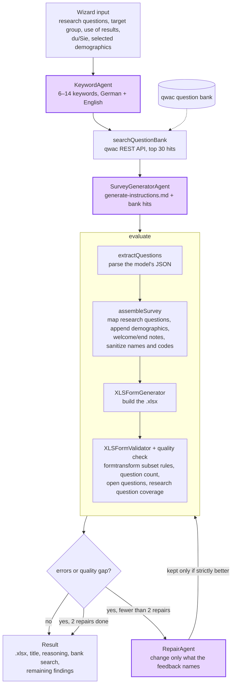

# FormulAid

[](./AI_DISCLOSURE.md)

A SvelteKit web app that generates [XLSForm](https://xlsform.org/) survey files. Uses `@ax-llm/ax` (TypeScript DSPy) with the [qwac](https://qwac.correlaid.org/) question bank to generate validated survey instruments.

Also ships as a **Claude Code skill** for terminal/IDE use — see [Skills](#skills).

## Prerequisites

- [Bun](https://bun.sh/) (package manager and runtime)
- [Node.js](https://nodejs.org/) >= 20
- An [OpenRouter](https://openrouter.ai/) API key (only for `test:workflow`)
- For the end-to-end tests: [uv](https://docs.astral.sh/uv/), and Java for ODK Validate (optional locally)

## Setup

```sh
bun install
cp .env.example .env
# fill in OPENROUTER_API_KEY
```

### Environment variables

| Variable             | Required           | Description                                                                                                        |
| -------------------- | ------------------ | ------------------------------------------------------------------------------------------------------------------ |
| `OPENROUTER_API_KEY` | Yes (scripts only) | Used by `scripts/initialize_agents.ts` for agent optimization. The web app takes the key from the user at runtime. |
| `GITHUB_TOKEN`       | No                 | Avoids GitHub API rate limits (60 req/h unauthenticated) when fetching CDL content snippets during build.          |

## Developing

```sh
bun run dev
```

## Building

```sh
bun run build
```

Preview the production build locally:

```sh
bun run preview
```

## Deployment

Deployed via [Coolify](https://coolify.io/) using [nixpacks](https://nixpacks.com/). The `nixpacks.toml` pins the Node and Bun versions used in the build container. The production server runs `bun serve.js`.

## Testing

```sh
bun run test       # unit tests
bun run test:e2e   # end-to-end: generated questionnaires → formtransform, LimeSurvey, Kobo
```

Both run in CI (`.github/workflows/ci.yml`) without a model or any secret.

### End-to-end (`tests/e2e/`)

Every fixture in `tests/e2e/fixtures/` holds a model's raw `generatedQuestions` plus the research questions and demographics. `pipeline.test.ts` runs it through the same code as the app after the model step (parse → `assembleSurvey` → workbook) and checks that:

- the formtransform validator reports no errors (warnings are snapshotted);
- formtransform converts it to a LimeSurvey TSV with every question, answer code and skip condition, and the opening/closing notes as welcome/end texts;
- the TSV converts back to XLSForm with the same questions and codes.

It writes the workbooks to `tests/e2e/output/`, and `test_pyxform.py` converts them with [pyxform](https://github.com/XLSForm/pyxform), the converter Kobo and ODK use on import, failing on errors and warnings. With Java installed, ODK Validate runs as well (`E2E_ODK_VALIDATE=0` skips it).

Fixtures are either hand-written for one known problem or saved from real runs (`real-*.json`, see below). A bug found in a real generation gets a fixture first, then a fix.

Answers marked `exclusive` ("Keine Angabe" in a `select_multiple`) are checked too: formtransform turns them into LimeSurvey's `exclude_all_others` and back ([formtransform#53](https://github.com/CorrelAid/formtransform/issues/53)).

### Real generations

```sh
bun run test:workflow                  # all cases; TEST_CASE=2 runs one
bun run test:workflow --save-fixture   # also saves each raw output as tests/e2e/fixtures/real-*.json
```

Runs the test cases through the full pipeline against OpenRouter (`OPENROUTER_API_KEY`, costs about $0.02 per case) and saves the outputs to `scripts/test_output/`. It prints the bank search, the questions and which research question each one serves. Override the model with `TEST_MODEL=<openrouter-slug>`.

## Skills

The survey generation logic is also packaged as an [Agent Skill](https://agentskills.io/home), `generating-xlsforms`. It works in the Claude apps (web, desktop) and in Claude Code, independently of this web app.

### Installing

**Claude apps:**

1. **Add the MCP connector:** go to **Customize → Add custom connector** and enter `https://qwacback.correlaid.org/mcp`.
2. **Install the skill:** download [`skills/xlsform.zip`](https://github.com/CorrelAid/formulaid/raw/main/skills/xlsform.zip), then go to **Customize → Skills → + → Create skill → Upload a skill** and choose the zip ([help](https://support.claude.com/en/articles/12512180-use-skills-in-claude)).

**Claude Code:** unpack the zip into `~/.claude/skills/` (for yourself) or `.claude/skills/` in a project, so that `SKILL.md` ends up in `~/.claude/skills/xlsform/`. Add the MCP connector with `claude mcp add --transport http qwacback https://qwacback.correlaid.org/mcp`.

**For a whole organization (Team/Enterprise):** an owner uploads the zip under **Organization settings → Plugins & skills**. It then shows up for every member, in the Claude apps and in Claude Code ([help](https://support.claude.com/en/articles/13119606-provision-and-manage-skills-for-your-organization)).

### Updating

The skill changes when it is rebuilt: new reference data from qwac and civic-data.de, prompt changes, or a formtransform update. An installed copy doesn't update itself.

**Which version do I have?** `SKILL.md` has a line `Skill version: <hash> (formtransform v<x.y.z>)` below its heading. Compare it with [the current one](skills/xlsform/SKILL.md). The hash only changes when the skill's content does.

- **Claude apps:** delete the old skill (**Customize → Skills**, ⋯ menu → delete), then upload the new zip as above. Whether uploading over an existing skill with the same name replaces it is not documented, so delete it first.
- **Claude Code:** replace the folder with the new zip's contents and start a new session. If you work in this repo, you can link the folder instead: `ln -s "$PWD/skills/xlsform" ~/.claude/skills/xlsform`. A `git pull` then updates it.
- **Organization-provisioned:** only an owner can update it: they upload the new version under **Organization settings → Plugins & skills**. Once it is approved, every member gets it automatically. Members who want a newer version have to ask their owner.

### Rebuilding (maintainers)

```sh
bun run build:skill
```

This fetches fresh reference data, writes `skills/xlsform/` and `skills/xlsform.zip`, and stages both. The pre-commit hook runs it too. The zip is reproducible: an unchanged skill gives a byte-identical zip, so when `skills/xlsform.zip` shows up in `git status`, the skill really changed. Commit and push it, since the download link above serves the zip from `main`.

## How a questionnaire is generated

Everything runs in the browser. The model is called with the user's own API key, straight at the provider, and the qwac question bank is queried from the browser too. `LeadAgent.run` in [`src/lib/agents/lead.ts`](src/lib/agents/lead.ts) ties the steps together.



Purple steps call the model; everything else is deterministic code.

| Step        | Model call | Progress shown as | File                                                  | What it does                                                                                                                      |
| ----------- | ---------- | ----------------- | ----------------------------------------------------- | --------------------------------------------------------------------------------------------------------------------------------- |
| Keywords    | yes, short | `searching`       | `keyword_agent.ts`                                    | proposes the constructs to search for, in German and English                                                                      |
| Bank search | no         | `searching`       | `qwacback.ts`                                         | stems the keywords, scores every bank question except the demographic standards, keeps the top 30; skipped if qwac is unreachable |
| Generate    | yes        | `generating`      | `survey_generator.ts`                                 | writes the questions from the methodology prompt and the bank hits, tags each with the research questions it serves               |
| Assemble    | no         | `validating`      | `lead.ts` (`assembleSurvey`), `sanitize.ts`           | adds demographics before the closing note, names the opening/closing notes, sanitizes names and codes                             |
| Build       | no         | `validating`      | `xlsform_generator.ts`                                | writes the survey, choices, settings and explanations sheets                                                                      |
| Validate    | no         | `validating`      | `xlsform_validator.ts`, `lead.ts` (`qualityFeedback`) | formtransform subset check plus the quality targets                                                                               |
| Repair      | yes, ≤ 2×  | `repairing`       | `repair_agent.ts`                                     | fixes the listed problems, keeps everything else                                                                                  |

Why it works this way:

- **The bank search is a fixed step**, not a tool the model may skip. The model only proposes keywords; the search runs in code ([#33](https://github.com/CorrelAid/formulaid/issues/33)).
- **Mechanical problems are fixed in code** before validation (names, choice codes, duplicates, references in skip logic), so only real problems reach the model ([#17](https://github.com/CorrelAid/formulaid/issues/17)).
- **Validator errors and quality gaps both trigger a repair.** The gaps are fewer than 8 answerable questions, more than 3 open ones, and a research question no question serves ([#34](https://github.com/CorrelAid/formulaid/issues/34)).
- **A repair fixes the previous attempt** instead of generating anew ([#16](https://github.com/CorrelAid/formulaid/issues/16)), at most `MAX_REPAIR_ATTEMPTS` = 2 times. A repaired version replaces the current one only if it is strictly better: fewer errors, or as many errors and a smaller quality gap.
- **The result is always delivered**, together with the remaining findings, never silently ([#11](https://github.com/CorrelAid/formulaid/issues/11)).

Everything inside `evaluate` is what the [end-to-end tests](#end-to-end-testse2e) run on their fixtures, so the diagram doubles as a map of what they cover.

## Architecture

FormulAid ships in two forms — web app and Claude Code skill — that share the same prompts, reference data, and backend tools.

### Prompts

`scripts/skill-content/generate-instructions.md` is the single source of truth for the generation instruction:

- Imported via `?raw` in `src/lib/agents/survey_generator.ts` → used as the `AxGen` system description
- Copied by `build_skill.sh` to `skills/xlsform/generate-instructions.md` → referenced in SKILL.md Step 3

### Reference data

`build_skill.sh` fetches live data from civic-data.de and the qwacback API. The methodology is embedded into `generate-instructions.md` at build time (used as the AxGen system prompt in the web app; read directly by Claude Code in the skill):

| File                                  | Skill          | Web app                                             |
| ------------------------------------- | -------------- | --------------------------------------------------- |
| `generate-instructions.md`            | read in Step 3 | `?raw` import → AxGen system description            |
| `references/demographic-templates.md` | read in Step 0 | not used (demographics hardcoded in `constants.ts`) |

### Question bank

Both look for validated instruments in the **qwac question bank** before writing questions from scratch, but differently.

|        | Claude Code skill                                                      | Web app                                                                                                                            |
| ------ | ---------------------------------------------------------------------- | ---------------------------------------------------------------------------------------------------------------------------------- |
| Access | native `qwacback:*` tools via the MCP connector                        | qwac's REST API (`/api/questions`), `src/lib/agents/qwacback.ts`                                                                   |
| Search | `search_questions`, `search_studies`, `get_question`, `list_questions` | a short model call proposes keywords (`keyword_agent.ts`); the search runs in code, without the demographic standards, top 30 hits |
| When   | Step 2, explicit                                                       | a fixed step before generation; the hits go into the generator prompt as `questionBank`                                            |

### What is not shared

|                | Skill                                          | Web app                                  |
| -------------- | ---------------------------------------------- | ---------------------------------------- |
| Intake         | Conversational phases 1–3                      | 3-section wizard form                    |
| XLSForm output | Claude Code writes `.xlsx` directly            | `XLSFormGenerator` builds it server-side |
| Demographics   | fetched from qwac / `demographic-templates.md` | hardcoded in `src/lib/constants.ts`      |

## AI usage

See [AI_DISCLOSURE.md](./AI_DISCLOSURE.md).
